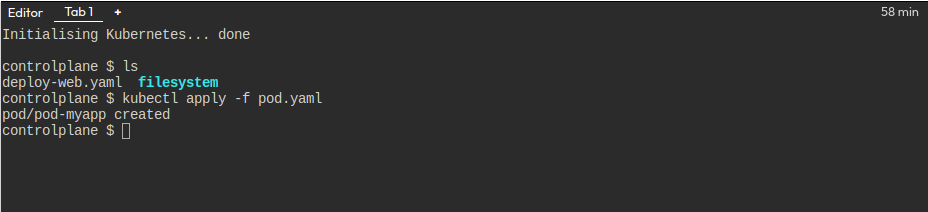
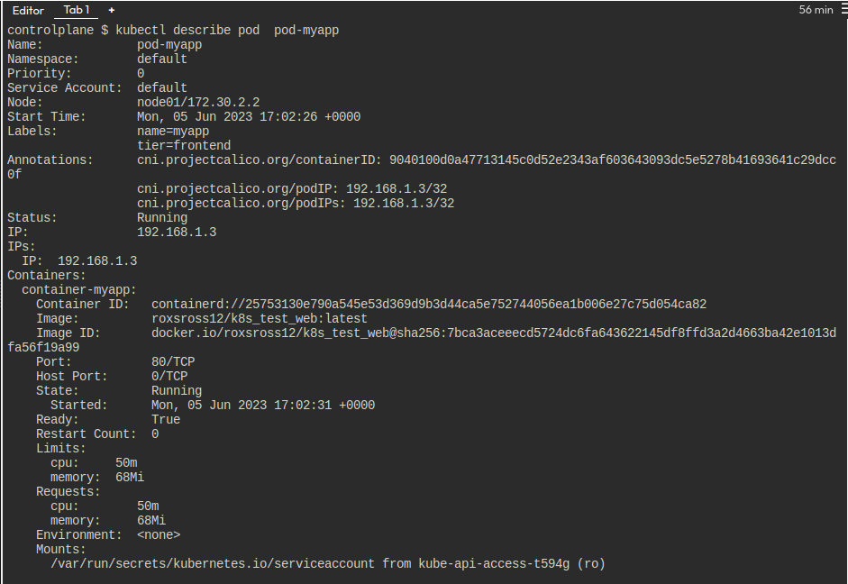
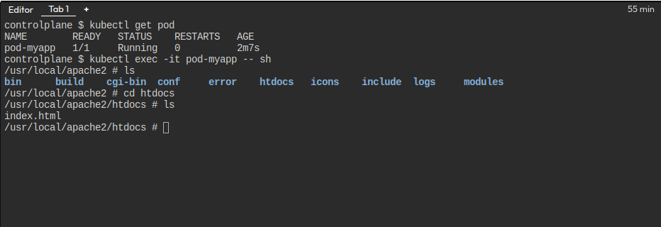
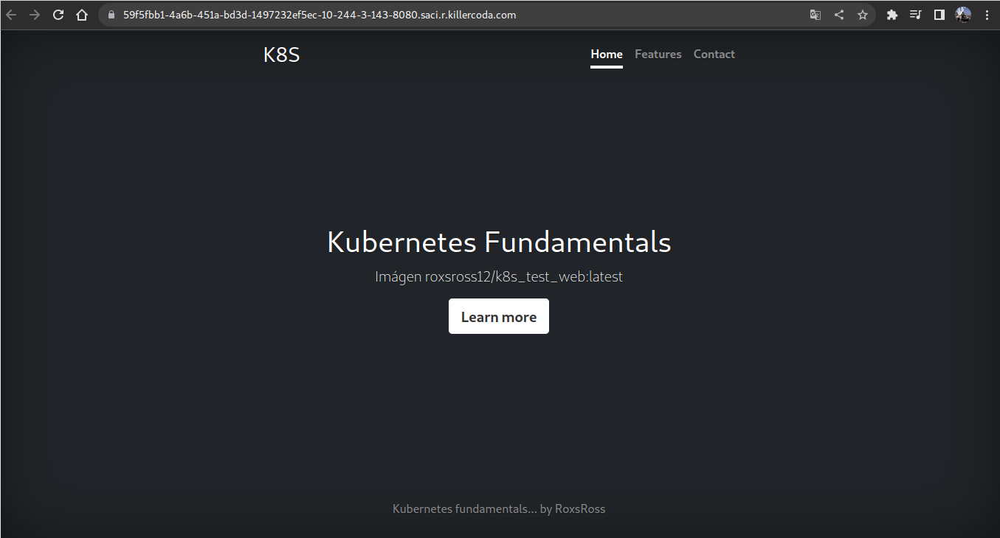
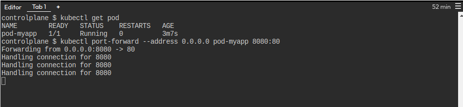
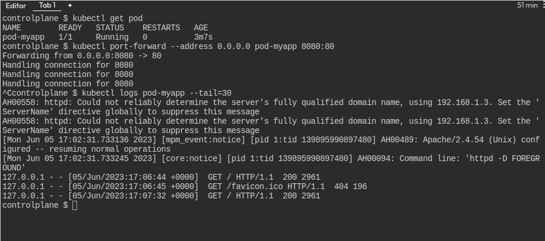

# solucion del lab 1

## Archivo yaml que has creado con la definición del Pod

## Imagen donde se comprueba que el Pod ha sido creado.

## Imagen donde se ve la información detallada del Pod.

## Imagen donde se ve el archivo `index.html` del DocumentRoot.

## Imagen del navegador accediendo a la aplicación con el `port-forward`.

## Imagen donde se ve los logs de acceso del Pod.

