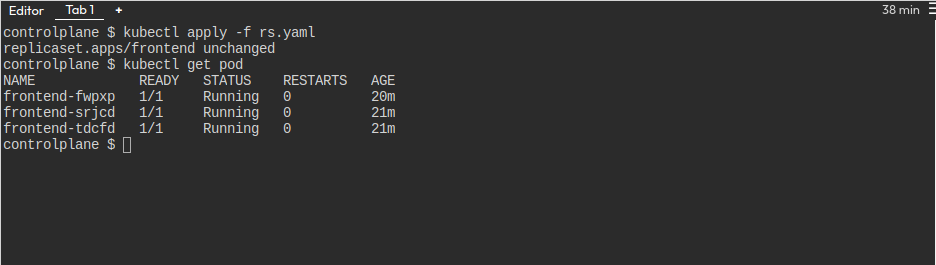
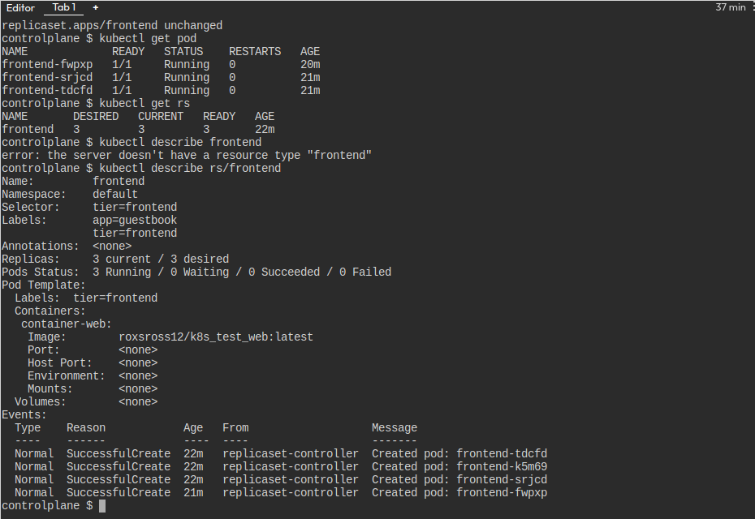
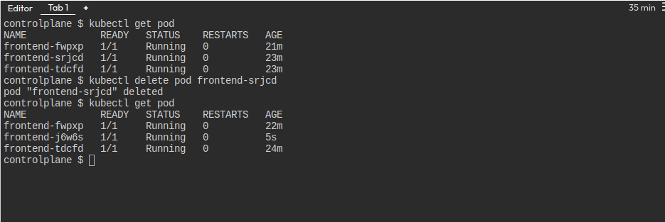
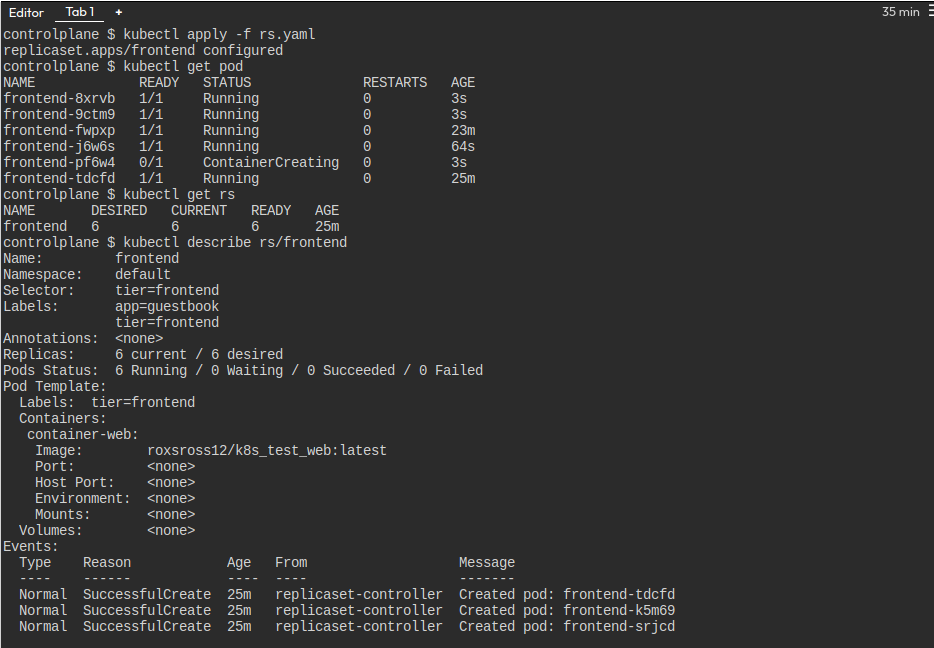

# solucion del lab 1

## Archivo yaml que has creado con la definición del ReplicaSet (**rs.yml**).

```
apiVersion: apps/v1
kind: ReplicaSet
metadata:
  name: frontend
  labels:
    app: guestbook
    tier: frontend
spec:
  # modify replicas according to your case
  replicas: 3
  selector:
    matchLabels:
      tier: frontend
  template:
    metadata:
      labels:
        tier: frontend
    spec:
      containers:
      - name: container-web
        image: roxsross12/k8s_test_web:latest
```

## imagen donde se comprueba que el ReplicaSet y los 3 Pods se han creado (**imagen2.jpg**).



## imagen donde se ve la información detallada del ReplicaSet (**imagen3.jpg**).



## imagen donde se ven los Pods que se han creado, después de eliminar uno de ellos (**imagen4.jpg**).



## imagen donde se ven los Pods que se han creado después del escalado (**imagen5.jpg**).
### modificando las replicas a 6

```
apiVersion: apps/v1
kind: ReplicaSet
metadata:
  name: frontend
  labels:
    app: guestbook
    tier: frontend
spec:
  # modify replicas according to your case
  replicas: 6
  selector:
    matchLabels:
      tier: frontend
  template:
    metadata:
      labels:
        tier: frontend
    spec:
      containers:
      - name: container-web
        image: roxsross12/k8s_test_web:latest
```


