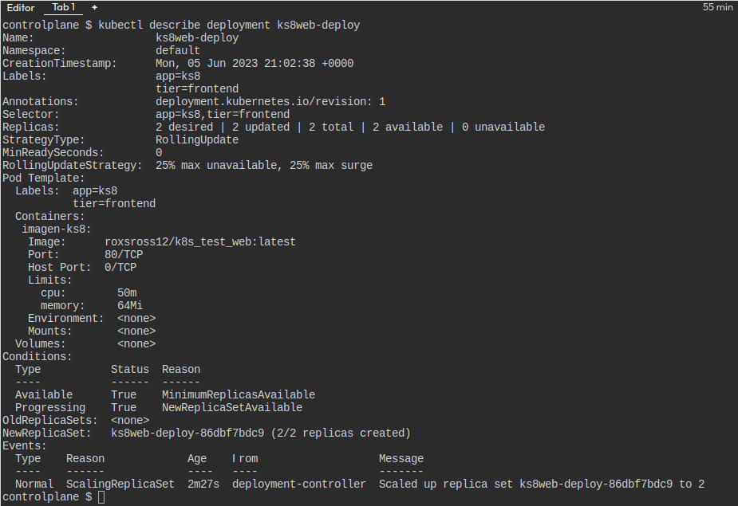
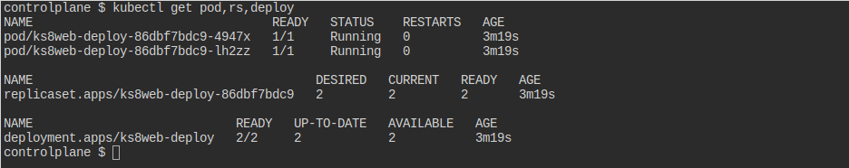
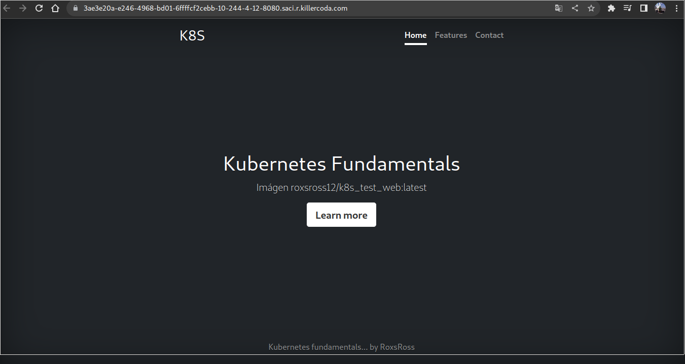
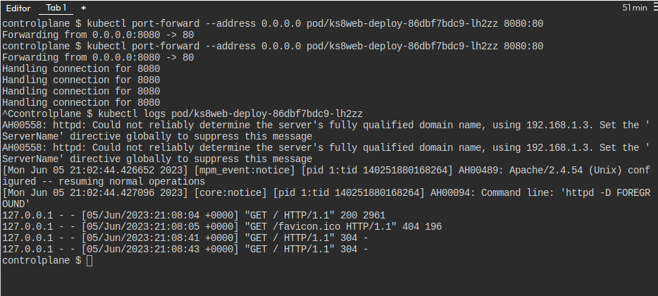

# solucion lab 3

## Crear el archivo yaml que has creado con la definición del Deployment (**deploy.yaml**).

```
apiVersion: apps/v1
kind: Deployment
metadata:
  name: ks8web-deploy
  labels:
    app: ks8
    tier: frontend
spec:
  replicas: 2
  selector:
    matchLabels:
      app: ks8
      tier: frontend
  template:
    metadata:
      labels:
        app: ks8
        tier: frontend
    spec:
      containers:
      - name: imagen-ks8
        image: roxsross12/k8s_test_web:latest
        resources:
          limits:
            memory: "64Mi"
            cpu: "50m"
        ports:
        - containerPort: 80
```
## imagen donde se comprueba los recursos que se han creado (**imagen2.jpg**).



## imagen donde se ve la información detallada del Deployment (**imagen3.jpg**).



## imagen donde se vea el acceso desde un navegador web a la aplicación usando el `port-forward` (**imagen4.jpg**).



## imagen donde se vea los logs del despliegue después del acceso (**imagen5.jpg**).

