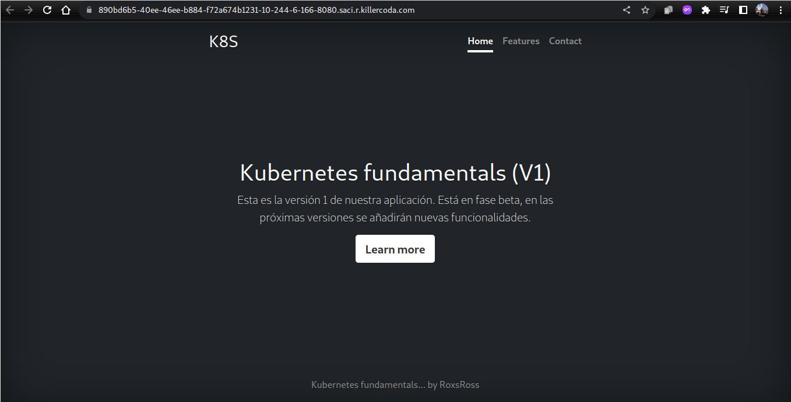
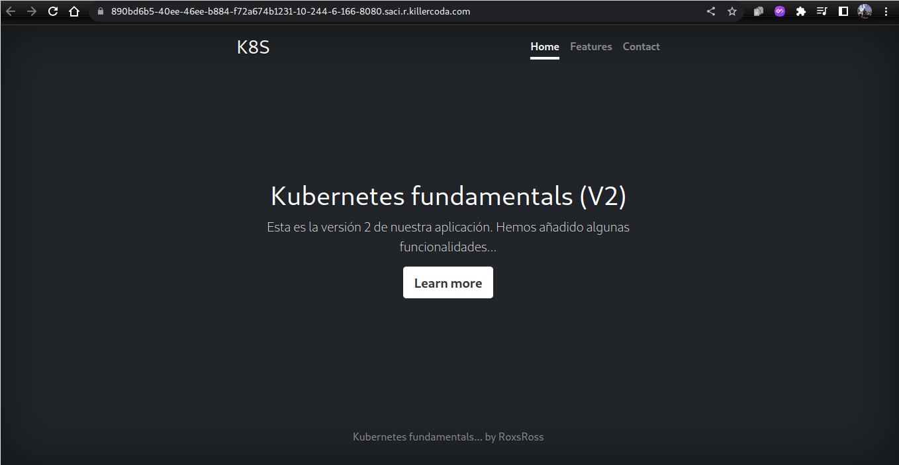
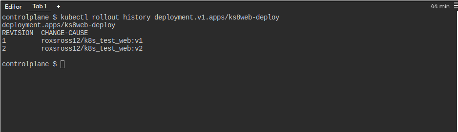
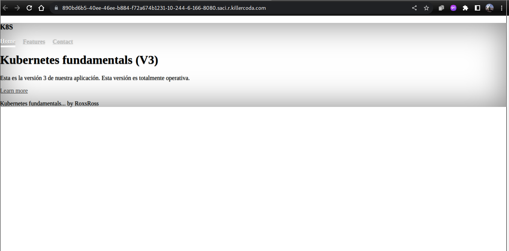
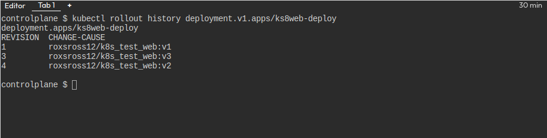
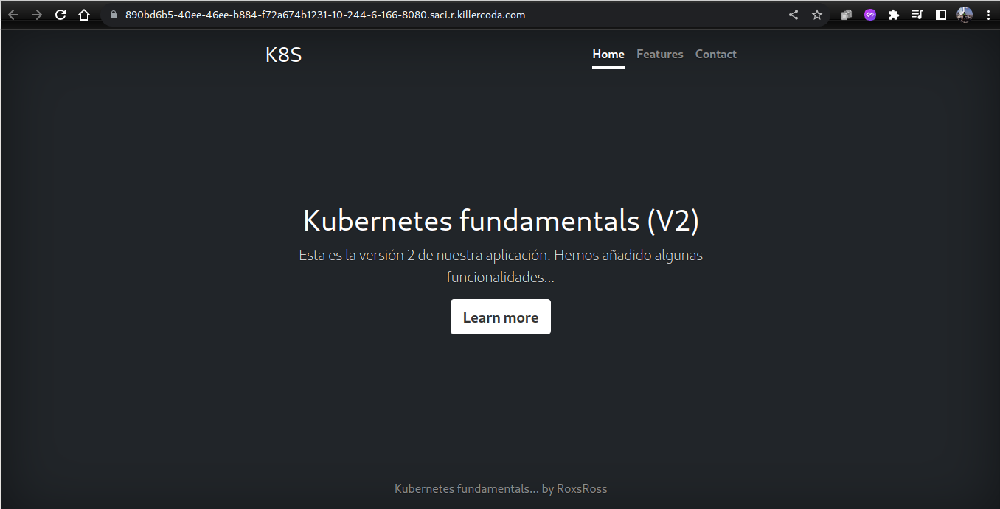

# solucion lab 3

## Crear el archivo yaml que has creado con la definición del Deployment (**deploy.yaml**).

```
apiVersion: apps/v1
apiVersion: apps/v1
kind: Deployment
metadata:
  name: ks8web-deploy
  labels:
    app: ks8
    tier: frontend
  annotations:
    kubernetes.io/change-cause: "roxsross12/k8s_test_web:v1"
spec:
  replicas: 3
  selector:
    matchLabels:
      app: ks8
      tier: frontend
  template:
    metadata:
      labels:
        app: ks8
        tier: frontend
    spec:
      containers:
        - name: imagen-ks8
          image: roxsross12/k8s_test_web:v1
          resources:
            limits:
              memory: "64Mi"
              cpu: "50m"
          ports:
            - containerPort: 80
```

## 1. imagen donde se vea el acceso desde un navegador web a la version 1 de la aplicación aplicación (**imagen1.jpg**).



## 2. imagen donde se vea el acceso desde un navegador web a la version 2 de la aplicación aplicación (**imagen2.jpg**).



## 3. imagen donde se visualice el historial de actualización del despliegue después de actualizar a la versión 2 (**imagen3.jpg**).



## 4. imagen donde se vea el acceso desde un navegador web a la version 3 de la aplicación (¡¡¡No se visualiza bien la hoja de estilos!!!) (**imagen4.jpg**).



## 5. imagen donde se visualice el historial de actualización después de realizar el *rollback* del despliegue (**imagen5.jpg**).



## 6. imagen donde se vea el acceso desde un navegador web a la version de la aplicación que queda después de hacer el rollout (**imagen6.jpg**).



